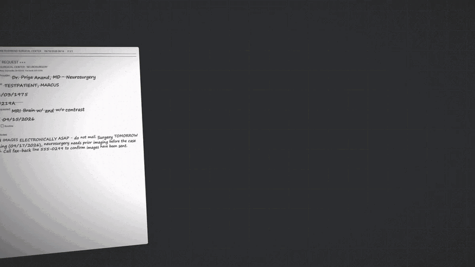

# Fax Triage

Reads incoming fax PDFs (imaging records requests), pulls out who sent it, which patient, which exams, how to deliver, and how urgent. Renames the file and writes a worklist. A human checks the result instead of reading every fax cold.

**Demo only. Fake data only.** Never put a real fax through this outside a signed HIPAA/BAA agreement.

[](promo/fax-triage-promo.mp4)

[Watch the 43-second promo video](promo/fax-triage-promo.mp4) (with sound). Rebuild it with `promo/build.sh`.

## Run

```bash
python make_fake_faxes.py
```
Makes 8 fake faxes in `faxes_in/`.

```bash
python triage.py
```
Reads `faxes_in/`, writes renamed copies plus `results.csv` and `results.json` into `faxes_out/`. Reruns skip faxes already done. Delete `faxes_out/` to start over. Takes about 15 seconds per fax.

```bash
python test_triage.py
```
Checks the filename, review-flag, and JSON parsing logic without calling the model.

```bash
python check_results.py
```
Scores `faxes_out/worklist.csv` against `expected.json` (the known answer for every fake fax). Prints each wrong field and a total. Use it to compare models: `python triage.py --model sonnet` then `python check_results.py`.

## Test faxes

- `make_fake_faxes.py` makes 12 faxes: most are printed forms filled in by hand (handwriting fonts), a few typed letters, one that is not an imaging request.
- `fill_real_forms.py` fills 5 real, public, blank hospital request forms (in `real_forms/`, from Cleveland Clinic, Stanford, Dartmouth, HSS, Washington Radiology) with fake handwritten data. Same fake names, same 555 numbers.

`real_forms/` is not in the repository. Download the blank forms yourself into `real_forms/` with these names:

| File | Source |
|---|---|
| `ccf_release.pdf` | https://ewebapps.ccf.org/MyImages/Content/help/MyImagesReleaseAuthorization.pdf |
| `stanford_upload.pdf` | https://stanfordhealthcare.org/content/dam/SHC/clinics/imaging-clinic/docs/radiology-image-library-upload-request-form.pdf |
| `dartmouth_request.pdf` | https://www.dartmouth-hitchcock.org/sites/default/files/2025-02/radiology-imaging-request-form_0.pdf |
| `hss_disc_request.pdf` | https://www.hss.edu/globalassets/files/hss-radiology-imaging-disc-request-form-ny.pdf |
| `washington_radiology_release.pdf` | https://www.washingtonradiology.com/sites/default/files/2022-02/washington_radiology_release_form_2020.pdf |

Nothing in this repository contains real patient data. Every test fax is generated.

## Output: `faxes_out/worklist.csv`

One row per fax. Short on purpose. Columns:

| Column | Example |
|---|---|
| `epic_search` | `TESTPATIENT, MARCUS 11/03/1975` (paste into Epic to get the MRN) |
| `imaging_type` | `RADIOLOGY`, `MAMMOGRAPHY`, `BOTH`, `CARDIAC` |
| `facility` | who is asking |
| `exam_dates` | `08/22/2026` or `01/01/2025 to 08/31/2026` |
| `exams` | `CT Abdomen/Pelvis; MRI Brain` |
| `delivery` | `ELECTRONIC`, `MAILED CD`, `UNKNOWN` |
| `method`, `send_to` | if electronic: `Ambra HPMC-7Q2X`, `PowerShare ...`, `Email ...` |
| `connection_lookup` | what the connectivity list says: `PowerShare: ...`, `on list, no electronic connection`, `not on list` |
| `mail_address`, `cd_copies` | if mailed CD |
| `reports`, `reports_fax` | `Y` or `N`, and the fax number on the request to send reports to |
| `route`, `needs_review`, `notes` | LEGAL / AKRON / HVTI etc., and what is missing |

No reason for request. Our job is to fulfil, not to know why.

Change a rule or `facilities.csv`, then rerun `python triage.py`: the rules re-run on faxes already extracted with no model calls.

## Routing rules (in Python, not in the model)

| Situation | Route |
|---|---|
| Law office, attorney, subpoena | LEGAL: fax to CCF Legal, not processed here, row left blank |
| Imaging performed at Akron General | AKRON: flag, push to Akron system |
| Cardiac exams only (echo, cath, stress, cardiac CT/MRI) | HVTI: forward fax to HVTI |
| Radiology and cardiac mixed | SPLIT_HVTI: work radiology here, email PDF to HVTI for cardiac |
| Dental or eye images | DENTAL_EYE: refer to that department |
| Not an imaging request | NOT_IMAGING |
| Everything else | RADIOLOGY |

Delivery, in order: Ambra share code on the fax, PowerShare destination on the fax, email on the fax, connection from `facilities.csv`, mailing address, else UNKNOWN (needs review).

Reports: facility in Care Everywhere (per `facilities.csv`) gets images only. Not in Care Everywhere, unknown facility, or reports explicitly requested gets images plus reports.

`facilities.csv` is a fake stand-in for the internal connectivity list. Replace it with the real one (same columns) to go live.

## How it works

1. Each PDF is handed to Claude (via the local `claude` CLI, model `haiku` by default, `--model sonnet` for harder faxes).
2. Claude returns one JSON object: facility, patients, exams, dates, delivery, priority, missing info, confidence.
3. Python decides `needs_review` (not an imaging request, missing info, low confidence, no patient, no exam) and builds the new filename: `PRIORITY_Facility_Patient_YYYYMMDD.pdf`.
4. Source PDFs are copied, never moved or deleted.

## Other models: cloud or local

The model call lives in one function, `extract()`. Two backends:

1. Default: the `claude` CLI on your subscription.
2. `--base-url`: any OpenAI-compatible endpoint that takes images. The fax pages are sent as PNGs. Key comes from an environment variable, never from a file.

OpenCode (uses your OpenCode login, no key to handle; a `provider/model` name selects this backend). OpenCode Go models are open-weight but run at opencode.ai, not on your PC:

```bash
python triage.py faxes_in faxes_out_kimi --model opencode-go/kimi-k3
python check_results.py faxes_out_kimi
```

Any OpenAI-compatible endpoint with a key in an environment variable:

```bash
set OPENAI_API_KEY=<key>
python triage.py faxes_in faxes_out_x --base-url https://host/v1 --model <model>
```

Ollama on a GPU PC (fully local, nothing leaves the machine):

```bash
ollama pull qwen3-vl:32b
python triage.py faxes_in faxes_out_local --base-url http://localhost:11434/v1 --model qwen3-vl:32b
```

Same prompt, same rules, same scoring for every backend.

## Does it need AI at all?

The rules do not. The reading does. `ocr_windows.ps1` runs Windows' built-in offline OCR (no install, CPU only) on any fax:

```bash
powershell -File ocr_windows.ps1 faxes_in\01A1836d.PDF faxes_in\01A182d7.PDF
```

Result: the typed fax comes back word for word. On the handwritten faxes the name, DOB, and MRN come back empty and the exam comes back as garbage. Free OCR is fine for typed faxes and useless for handwriting, which is most of the real volume.

## Accuracy on the 17 handwritten test faxes (Sept 16, 2026)

| Model | Where it runs | Fields correct | What it got wrong |
|---|---|---|---|
| Kimi K3 via OpenCode | opencode.ai cloud | 107 / 107 | Nothing. About 2 seconds and 3 cents per fax. |
| Qwen 3.8 Max via OpenCode | opencode.ai cloud | 106 / 107 | One cramped handwritten DOB left blank and flagged. Slow: minutes per fax on this service. |
| Sonnet (default) | Anthropic cloud | 105 / 107 | One mail address that looked struck through by a form line. Flagged for review, not guessed. |
| Haiku | Anthropic cloud | 104 / 107 | Two handwritten DOBs it could not read. Left blank and flagged. Before the "do not guess digits" rule it read them confidently wrong. |

## DOB cross-check (free second reader)

Every fax also goes through Windows OCR. If OCR finds a date right after a "DOB" label and it differs from the model's DOB, the row is flagged: `DOB conflict: model 01/14/1923, OCR 01/19/1983: verify`. OCR is only trusted where it found a labelled DOB, so handwritten faxes it cannot read add no noise. A fax with several patients is fine: any OCR DOB that matches any patient counts as agreement. Stored once per fax in `results.json`.

Every route (legal, Akron, HVTI, split, not imaging), every delivery type, and every share code was correct with both models. Use `python check_results.py faxes_out_sonnet` to reproduce.

A bug found by this test: fuzzy facility matching once matched "Washington Radiology" to "Summit Ridge Cardiology" on the list and would have sent images to the wrong place. Matching is now strict (same first word, near-exact or contained name) and any non-exact match is marked "verify" in the worklist.

## Cost

Sonnet: roughly 5 to 10 cents per fax on the API, about 30 seconds each on the CLI. On the CLI it uses the Claude subscription.
